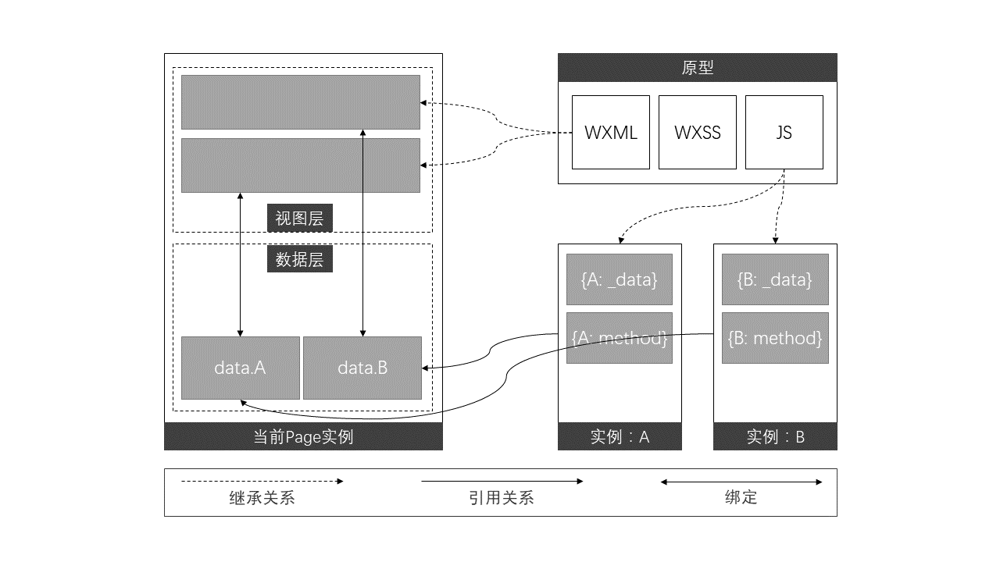

## 小白健康小程序代码阅读心得

> 可能会有不准确或错误的地方，希望大家交流指正

### 序言

经过这两天的阅读，心里基本对整个项目有了一个较为清晰的认识，项目其实并不复杂，但是受限于微信小程序官方api的限制，很多功能不得不自建轮子，比如宋亮说的实现地不太优雅的组件化系统，为了方便对比，本文拿当下比较完善的小程序框架`wepy`来进行对比，对比内容也着重放在组件化的实现上。此外，笔者也会将阅读代码时发现的可改进之处提出来，供大家交流讨论。

### 代码结构与编码规范  

其实前端工程化的实践经由`React`, `Angular`和`Vue`几大框架历练至今，已经形成了一个相对成熟的形态，文件路径的设置以及文件夹的结构和命名基本上时大同小异，所以只要稍微对前端工程化熟悉一点，就可以很快上手一个新的项目。

本项目也不例外，各个文件夹职责分明，结构清晰，从文件夹名基本就可以判断出其职责所在，这一点上也无可挑剔。

继而讨论编码规范，这里有两点需要吐槽的，下面一一来讲。

1. 驼峰式与下划线式命名方式共存。这个问题其实说大不大，说小不小，命名方式这种东西带有很强的个人色彩，经过笔者观察，本项目所有的自建函数都是采用下划线式命名，但W3C标准制定的 HTML Dom api 却无一例外采用的驼峰式命名，前端社区也基本都是提倡使用驼峰式命名来写js。但鉴于项目本身代码量已经不少了，为这个问题大动干戈也有些不实际，这里只是稍微提一下。

2. 注释缺失或格式不统一。相比上面命名问题，笔者认为这个问题更重要一点，因为注释的质量直接关系到了整个代码的可读性，良好的注释习惯可以大幅降低沟通成本。经笔者观察，项目中大部分文件是**没有一行注释的**，可能开发者在进行开发时认为这个文件逻辑简单，不需要太多注释，但注释是一个编码习惯问题，人在编码时对复杂度的判断标准是时刻波动的，举个例子，你在精力充沛时可以对一个包含200+行代码和10多个函数的文件了如指掌，但只要过个半天回来看，会发现还要花上一段时间来熟悉代码。所以笔者建议对本项目的注释加强规范，注释标准可参考[JSdoc](http://www.css88.com/doc/jsdoc/index.html)。一些简单的例子可以查看附录1。

### 组件化实践——对比`wepy`

笔者认为，小程序的组件化绝对是小程序开发中最大的痛点，可能官方对小程序的定位是仅承载轻量交互的即开即用的载体，但现在显然越来越多的初创公司选择将交互重心放在了webapp和小程序这类易于分发的载体上了，项目复杂度也随之上升，更完善的组件化也愈发重要。

小程序原生提供的组件化很奇怪，引用官方的描述：

> wxs 模块均为单例，wxs 模块在第一次被引用时，会自动初始化为单例对象。多个页面，多个地方，多次引用，使用的都是同一个 wxs 模块对象。

由于小程序的框架是采用与vue类似的数据与视图绑定逻辑，但小程序把数据、视图和样式剖分成了三个文件，运行时通过文件名将三者绑定在一起，其中`wxml`的模块化逻辑是，模板的引用相当于把被引用模板的代码拷贝到引用处，也就是说，被引用模块与引用模块共用一个数据作用域，被引用的模块没有自己的作用域，这就从根本上决定了组件嵌套在小程序框架下是无法实现的。

对于上述模块化出现的问题，`wepy`采用了预处理的思路，编码时采用类似`vue`的单页面组件，视图、数据和逻辑写在同一`.wpy`文件中，然后通过一个预处理程序将`.wpy`文件解耦为`wxml/wxss/wxs`，有了预处理层，才有了真正意义上的模块化，如下图所示：

`wepy`通过对方法和数据加前缀预处理的方式，实现了作用域隔离，从而实现了组件嵌套，这其实也是`React/Vue`一直在做的事情，这也是为什么`React/Vue`在渲染列表子元素的时候一定要指定`key`的原因。

然后再说一说本项目采用的组件化思想，本项目直接将所有的可复用组件放在一个大模块（`components/component`）里面，需要用的时候只需要分别引用这个`component`里的三大文件。`components/base`用纯js方法对模块进行了封装，利用`component_id`对各个组件的数据进行分割，这样只需要在`wxml`中将`component_id`与对应的template进行捆绑，即可实现数据作用域的组件化，相当于把`wepy`中的预处理操作手动实现了。

